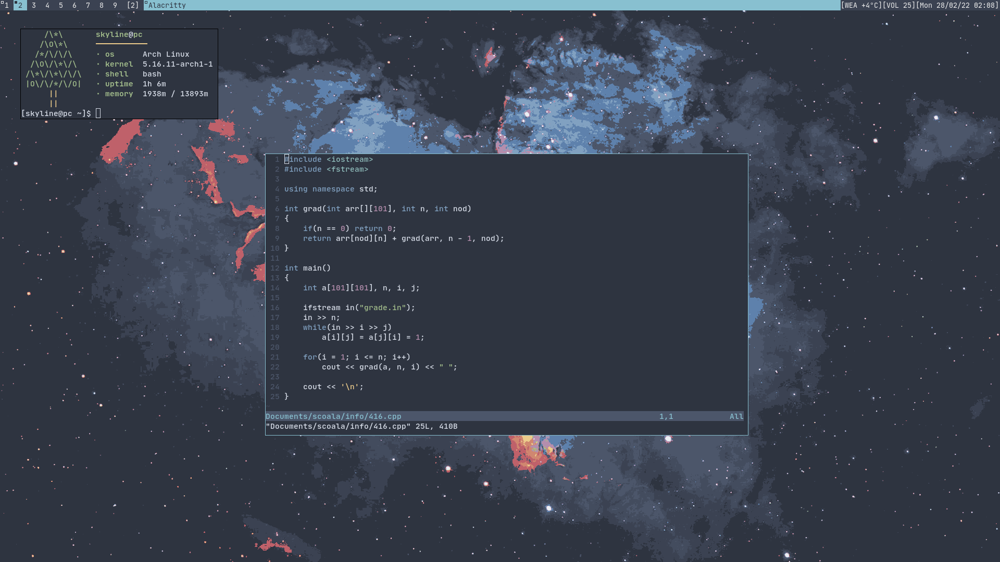

# dwm dotfiles

## General information

- Distro: `Arch Linux`
- WM: `dwm`
- Terminal: `alacritty`
- Text editor: `vim`
- File manager: `ranger`
- Compositor: `picom`
- Font: `JetBrainsMono Nerd Font`

## Notes
DWM is patched with [fullgaps](https://dwm.suckless.org/patches/fullgaps/), [fibonacci](https://dwm.suckless.org/patches/fibonacci/) and [alwayscenter](https://dwm.suckless.org/patches/alwayscenter/).
